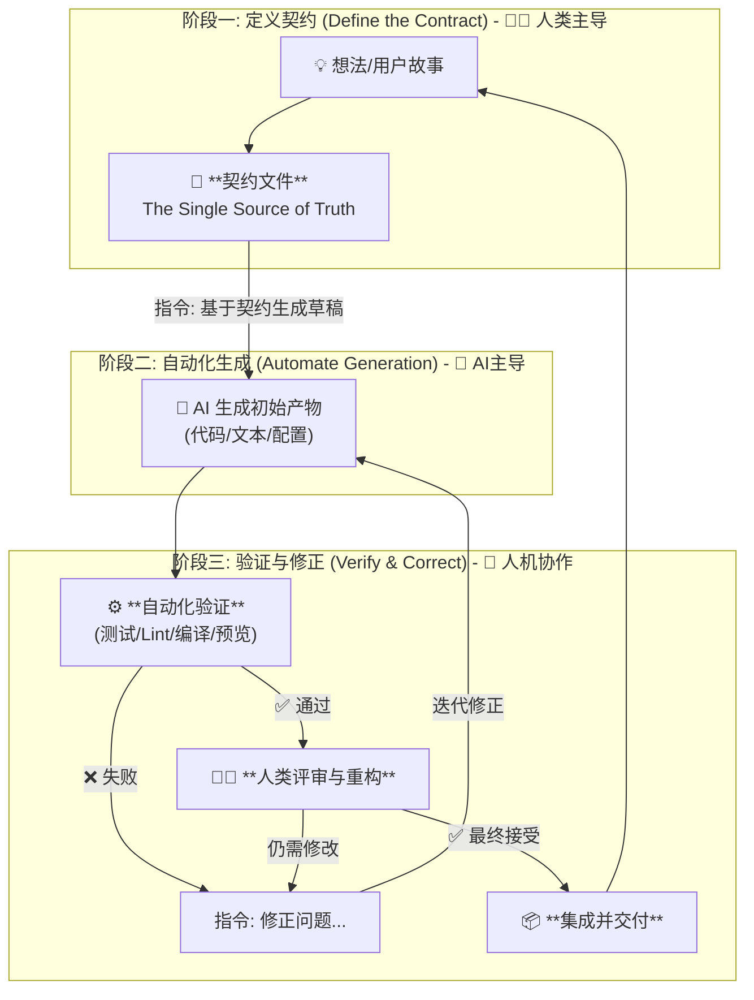

# 通用工作流指南：契约驱动的自动化 (CDA)

本文档旨在提供一个通用的、跨项目类型的工作流程，它优雅、简洁，能适应前后端分离网站、命令行工具、AI指令集、教学讲义等多种开发场景。

## 核心哲学：万物皆“契约”

所有工作流的核心都可被抽象为 **“输入 -> 处理 -> 输出”** 的模式。我们通过为这个模式建立一份精确的、机器（和人类）可读的“契约”来驱动整个流程。我们称之为 **“契约驱动的自动化 (Contract-Driven Automation, CDA)”**。

## CDA 通用工作流程

此流程分为三个核心阶段，适用于所有项目类型。



## 核心概念：契约 (The Contract)

“契约”是项目的“单一事实来源 (Single Source of Truth)”。它是一份清晰、明确的蓝图，定义了产物的规格、行为和结构。

下表展示了不同项目类型对应的契约形式：

| 项目类型 | 契约文件 (Contract Artifact) | 产物 (Generated Artifact) | 自动化验证 (Verification) |
| :--- | :--- | :--- | :--- |
| **前后端分离网站** | `openapi.yaml` (后端)<br>`DesignSystem/Tokens.json` (前端) | API代码、SDK<br>UI组件代码 | API测试 (Postman)<br>单元/集成测试 (Jest)<br>视觉回归测试 (Storybook) |
| **命令行工具 (CLI)** | `CLI_DESIGN.md` (定义参数、命令和输出) | `main.py`, `commands/` | 单元/集成测试 (pytest) |
| **AI指令集** | `AGENT_BEHAVIOR.md` (定义行为、工具和目标) | `prompt_chain.json`, `tool_definitions.py` | 单元测试 (模拟输入/输出)<br>端到端评估 (Eval) |
| **教学讲义** | `COURSE_OUTLINE.md` (定义章节、目标和示例) | 章节的Markdown文件<br>示例代码片段 | 语法/拼写检查 (Linter)<br>代码片段编译/运行测试 |

---

## 实践指南与常见问题 (FAQs)

### 1. 如何处理用户故事 (User Story)？

**用户故事并不直接生成一个新契约。**

把它们的关系想象成：

* **User Story = 变更请求 (Request for Change)**
* **契约 = 系统蓝图 (System Blueprint)**

一个用户故事出现时，它会**驱动你去修改一个或多个已存在的契约**。例如，“CLI工具需支持JSON输出”这个故事，会让你去更新 `CLI_DESIGN.md` 文件，而不是创建一个新的契约。这个故事是改变的**起因**，而对契约的修改是改变的**精确定义**。

### 2. 一个项目可以有多个契约吗？

**是的，不仅可以，而且必须有。**

一个成熟的项目是多个模块的组合。为每个重要的“接口”或“边界”定义独立的契约，是优秀软件架构的标志。在一个典型的Web应用中，你至少会管理以下契约：

* **API 契约**: `openapi.yaml`，定义前后端数据交换。
* **UI 契约**: `DesignSystem/` 目录，定义视觉与交互。
* **数据契约**: `schema.sql` 或 ORM 模型，定义数据存储。
* **环境契约**: `docker-compose.yml`，定义运行环境。

拥有多个契约能让项目保持清晰、模块化，并支持团队（或人机）高效协作。

### 3. 契约文件应该放在哪里？

**遵循“就近原则 (Colocation)”，而不是集中存放在一个 `/contracts` 目录。**

将契约文件放在它所描述和服务的代码附近。这能提供上下文、增强内聚性、并让项目结构更易于被发现和理解。

#### 推荐的目录结构示例

```
my_project/
├── 📂 backend/
│   ├── 📂 api/
│   │   └── 📜 openapi.yaml  <-- API契约，紧邻其实现代码
│   └── 📂 database/
│       └── 📜 schema.sql    <-- 数据契约，紧邻数据库代码
│
├── 📂 frontend/
│   └── 📂 src/
│       └── 📂 design_system/
│           └── 📜 tokens.json       <-- UI契约，作为前端代码的一部分
│
├── 📂 cli_tool/
│   └── 📜 CLI_DESIGN.md   <-- CLI的设计契约，位于该工具的根目录
│
└── 📂 docs/
    └── 📜 COURSE_OUTLINE.md <-- 讲义的契约，位于文档项目的根目录
```

**位置本身就是一种信息。** 合理的存放位置能让项目的组织结构不言自明。

## 总结

CDA工作流的核心优势在于：

1. **单一模式**: 只需一个思维模型即可应对所有项目。
2. **关注点分离**: 将“设计思考”（定义契约）与“机械执行”（生成与验证）分离，让你专注于创造性工作。
3. **杠杆效应**: 精心打磨的“契约”成为驱动AI高效、准确产出的核心杠杆。
4. **可预测性**: 产出质量由契约的质量决定，使整个流程稳定可控。
